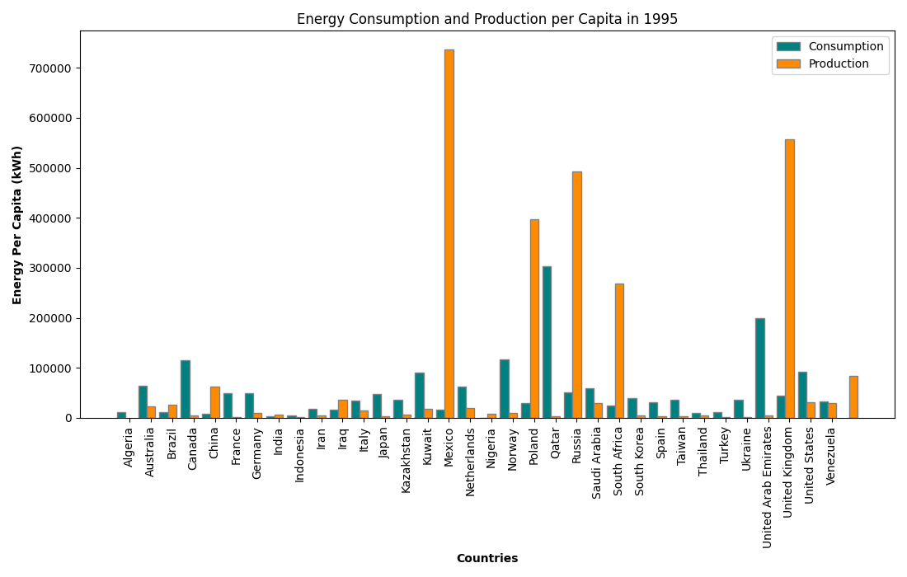
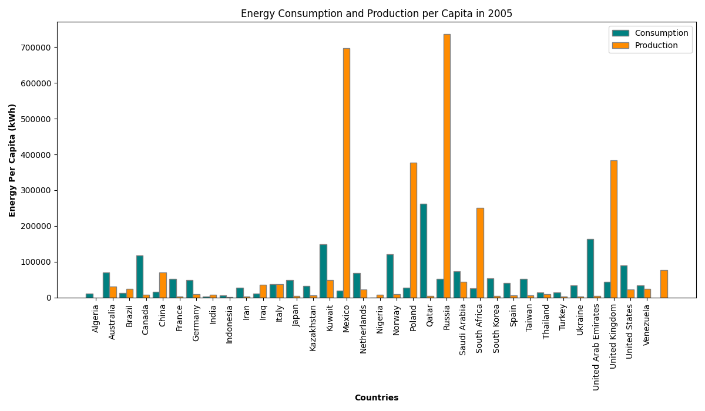
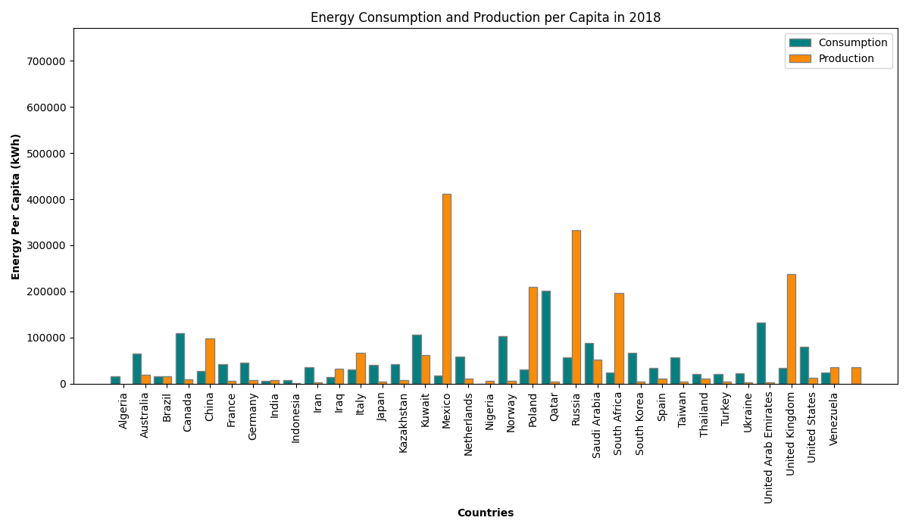
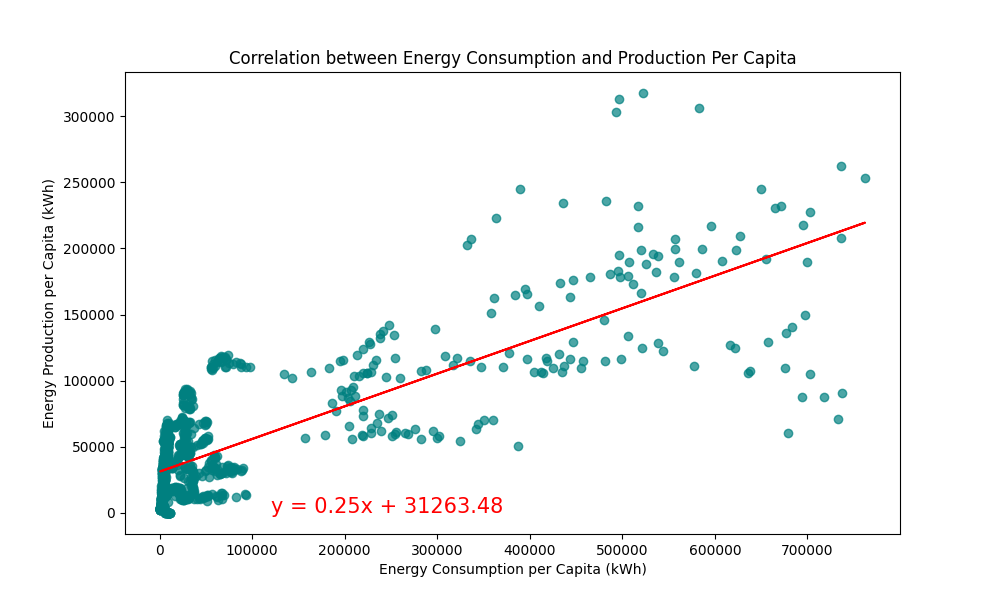
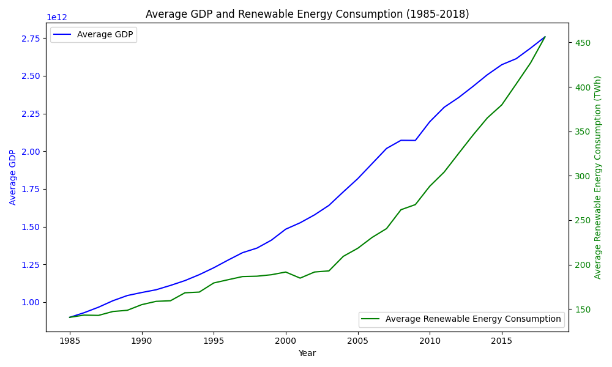
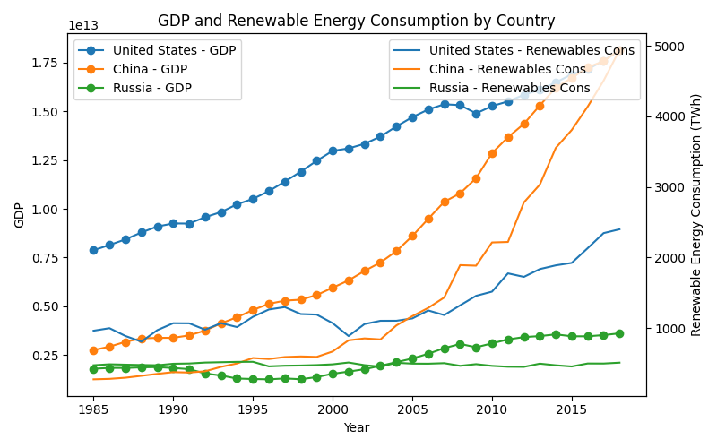
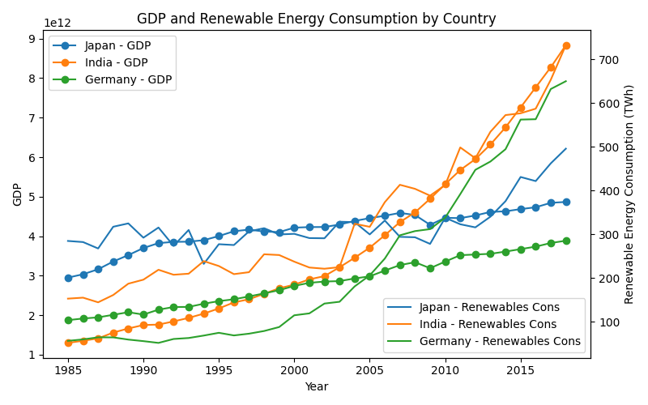
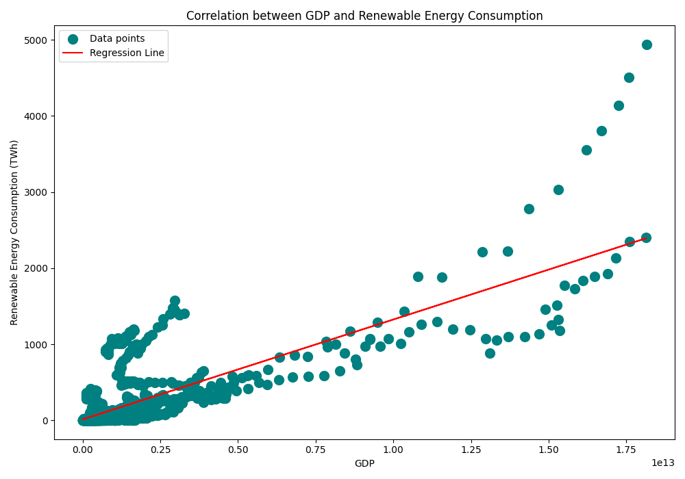

#Read the file we downloaded from Kaggle(https://www.kaggle.com/datasets/pralabhpoudel/world-energy-consumption/data)
#Data is reviewed and cleaned up
  - All columns are reviewed to see what we have
  - Info for the data fields is listed
  - Listed all fields with unavailable data
  - Filled all NAs with 0s to make calculations later
    
#Once data is reviewed, we created some additional columns: non_renewables_consumption, Total Energy Consumption, non_renewables_production, Total Energy Production,
non-renewables_prod_per_capita, total_prod_per_capita, non-renewables_cons_per_capita, total_cons_per_capita

#Displayed all data fields and their count

#We created countries_world_energy_df dataframe based on iso_code not equal to 0. Then we locked the data fields to >= 1985. So we can look at about 40 years of data

#We created top_countries data field based on:
  - Sorted countries_world_energy_df dataframe by Total Energy Production and Total Energy Consumption to find the top countries to include in the dataframe
  - The datafield we created included 89% of the World's Energy Production and Consumption
    
#We created top10_country_consumption and top10_country_production dataframes

#We created top_countries_renewable_cons and top_countries_renewable_prod that represented 80% of World's Renewable Energy Consumption and 77% of the World's Renewable Energy Production

#We created a dataframe filt_countries_world_energy for 2022 which is the last reported year with all production and consumption data

#Created a pie graph to show renewable energy consumption categories in 2022

#Created a pie graph to show non-renewable energy consumption categories in 2022

#Created a pie graph for renewable vs non-renewable energy consumption to see the current outlook

 We made a dataframe including only data through 2018 because the US didn’t have any GDP data beyond that year and we needed that data specifically for one of our questions.

 # What is the Relationship Between Energy Production Per Capita and Energy Consumption Per Capita Across Countries?

 We chose three different years, nearly a decade apart each, to plot the energy consumption per capita and the energy production per capita for each country in that year. 

# These graphs show:
- There are few countries that produced the same amount of energy per capita as they consumed per capita. 
- Several of the countries produced less than they consumed per capita. 
- Then there are some that produced more energy per capita than they consumed per capita. 

- Looking at these graphs we see that there is some shift in production and consumption per capita between countries, but the overall shape of the data per capita stays generally  stable throughout the years. It is interesting to note that the graph of 2018 data shows a decrease in production and consumption per capita overall. This could possibly be due to better technology or more global concerns about energy consumption. It definitely merits more research.

# Statistical Analysis of Total Energy Production Per Capita vs Total Energy Consumed Per Capita for Countries Representing 90% of the World’s Energy Production and Consumption 

  - Correlation Coefficient: 0.79
  - r^2 :  0.62
  - T-statistic: 5.296761358343689
  - p-value: 1.3704128715598114e-07
  - ANOVA for Energy Consumption Per Capita from 2008-2018:
  - F_onewayResult(statistic = 0.014319448497051985, p value = 0.9999999844247471)
  - ANOVA for Energy Production Per Capita from 2008-2018:
  - F_onewayResult(statistic = 0.04569316056743195, p value = 0.9999954920296542)

 The correlation coefficient of 0.79 suggests that the energy consumption per capita and energy production per capita are strongly correlated. The r^2 value of 0.62 shows moderate to strong association between the consumption and production, but since 38% of the variability is still unexplained there is potential for further modeling. The positive T-statistic and the very small p-value suggests there is a statistically significant positive difference between energy production per capita and energy consumption per capita across the countries in our dataset. This suggests that energy production per capita exceeds energy consumption per capita across countries we looked at.  

 This could possibly mean certain regions rely on energy imports and others produce excess to fill that need, or perhaps different countries have better production efficiency or different energy needs. 

 The ANOVA results with f-statistics both very low and the p values extremely high indicate that energy consumption per capita and energy production per capita have been relatively stable across the years 2008-2018. 

# Is There a Correlation Between Renewable Energy Consumption and GDP Across Countries

 We calculated the average GDP and Average Renewable Energy Consumption for countries across the years and plotted the information.

-This graph shows similar shapes in the lines of Average GDP and Average Renewables Energy Consumption 

 We chose the top six countries for overall energy consumption and plotted GDP and renewable energy consumption for each of them from 1985-2018

# These graphs show:

- The United States, China, and India all have GDP and Renewable Energy Consumption lines that generally follow each other in shape. 
- Russia’s GDP has had minimal changes over time with a slow, but mostly steady increase of GDP since the early 2000’s, and their renewable energy consumption is nearly unchanged over time. 
- Japan’s renewable energy consumption generally follows the GDP curve, but with more variability and then a steep increase from around 2012 on.
- Germany’s GDP has had steady growth and their renewable energy consumption followed that  until around 2000 when it started to increase steeply.
- The United States has the largest gap between GDP and Renewable Energy Consumption, possibly indicating a slower adoption of renewable energy sources.
- China has had the fastest growth in both GDP and Renewable Energy Consumption
- Overall we see that the general trend of  increased GDP with increased renewable energy consumption.

# Statistical Analysis of GDP and Renewable Energy Consumption for Countries Representing 90% of the World’s Energy Production and Consumption 

- We predicted there would be a positive correlation between GDP and renewable energy consumption because we assumed that more wealthy countries would have the technology and social knowledge/pressure to access and use renewable energy.

    Correlation Coefficient: 0.79
    T-statistic: 20.76401788304955
    p-value: 1.2461860989954291e-81
    ANOVA for Renewables Consumption:
    F_onewayResult(statistic = 0.31264537493261196, p value = 0.9777430943553933)
    ANOVA for GDP
    F_onewayResult(statistic = 0.14436975081836945, p value = 30.9990640510303093)

- The correlation coefficient of 0.79 suggests that GDP and renewable energy consumption have a strong positive correlation. This indicates increases in GDP correlates to increases in renewables consumption. The positive T-statistic and the very small p-value suggests there is a statistically significant positive difference between GDP and renewables energy consumption across the countries in our dataset. 

- The ANOVA results with f-statistics both very low and the p values extremely high indicate that GDP and renewables energy consumption have been relatively stable across the years 2008-2018. 

- This positive correlation between GDP and Renewables Energy Consumption supports our hypothesis that these variables are positively correlated. This strong positive correlation could imply that as countries become wealthier they may also be more conscious of climate change and sustainability. Perhaps wealthier countries are more likely to invest in renewable energy sources. They may have more technological advancements, government policies to require/incentivise use of renewable energy, or financial capacity to invest in such sources. 

# To show "energy production and consumption fluctuations correlate with major events", we followed below steps:
 - Created a line graph for renewable and non renewable energy production and consumption over the years with the major events to see the trends

 - Created events dataframe and merged with our main dataframe to include the events we want to analyze. We then created new columns for lagged years as effects of major events may have delayed or lingering impacts

 - Regression analysis with lagged variables

 - Regression results for "energy production and consumption fluctuations correlate with major events" supported the fact that there is a correlation between major events and energy production/consumption values

# To show "projected renewable energy consumption trends for the next 50 years", we followed below steps:
 - Built a linear regression model and projected future renewable energy consumption levels

 - Calculated projected percentage change in renewable energy consumption in 2072: 201.83%
   
# Found projected values for non-renewables energy consumption and created dataframe

# Merged data frames for both projected values and plotted a pie chart to show projected energy consumption values for 2072

# We creataed six continents to expand analysis based on total_production_per_capita and total_consumption_per_capita 
 - We made a hv.plot.line to see Total Energy Consumption/Production Per Capita Over Time by Continent 

# We made a scatter plot to see correlation value between total_production_per_capita and total_consumption_per_capita. 

# We calculated the correalation value 
- The correlation value between total energy consumption per capita and total energy production per capita is 0.93, which indicates a strong positive correlation. 

# We did Statistical tests which is the T-test and Anova test 
As a result :

- T-statistic: -10.633693692517605, p-value: 2.0983809186947106e-22
- The t-test results indicate a significant difference between total_prod_per_capita and total_cons_per_capita values. Given the negative t-statistic, we can conclude that total_prod_per_capita is significantly lower than total_cons_per_capita in the six_continents data. This finding could imply that, on a per capita basis, production levels are insufficient to meet consumption demands, which might indicate a reliance on energy imports or suggest other factors impacting energy availability and usage across these regions.

F_onewayResult(statistic=0.0066544684672841525, pvalue=0.999999999535522)
The ANOVA test results indicate that there is no significant difference in total_cons_per_capita across the years 2012 to 2022.
In practical terms, this suggests:
Stability over Time: The per capita energy consumption has remained relatively stable across this period, with little to no variation from year to year. 

# REFERENCES 

- Ritchie, H., Rosado, P., Mathieu, E., & Roser, M (2023). Our World in Data: Energy dataset. Our World in Data. Retrieved from: [https://www.kaggle.com/datasets/pralabhpoudel/world-energy-consumption/data]
  
- Energy Institute - Statistical Review of World Energy (2024) [https://www.energyinst.org/statistical-review/]
 
- Ember - Yearly Electricity Data (2024) [https://ember-climate.org/data-catalogue/yearly-electricity-data/]; Energy Institute - Statistical Review of World Energy (2024) [https://www.energyinst.org/statistical-review/]
 
- Population based on various sources (2023) [https://ourworldindata.org/population-sources]
  
- U.S. Energy Information Administration - International Energy Data (2023) [https://www.eia.gov/opendata/bulkfiles.php]

- International Renewable Energy Agency (IRENA)-Renewable energy statistics (2023) [https://www.irena.org/Publications/2023/Jul/Renewable-energy-statistics-2023]

ChatGPT help on creating graphs with hvplot.pandas
- Creating event indicators for the major events, help from chatGPT
  def create_lagged_event_indicator(events_merge_df, lag_years=2):
    """
    Creates lagged event indicators for up to `lag_years` after the event.
    For example, if an event occurred in 2014, it will flag the years 2015, 2016, etc.
    """
    for lag in range(1, lag_years + 1):
        events_merge_df[f'event_indicator_lag_{lag}'] = events_merge_df['event_indicator'].shift(+lag, fill_value=0)
    return events_merge_df
- Regression analysis with lagged variables, help from chatGPT:
 
    X_prod = sm.add_constant(X_prod)
    X_cons = sm.add_constant(X_cons)

    model_prod = sm.OLS(y_prod, X_prod).fit()

    model_cons = sm.OLS(y_cons, X_cons).fit()

- ChatGPT help: 
  bar charts with all countries and both per capita variables
  left and right axes line plots 
  
