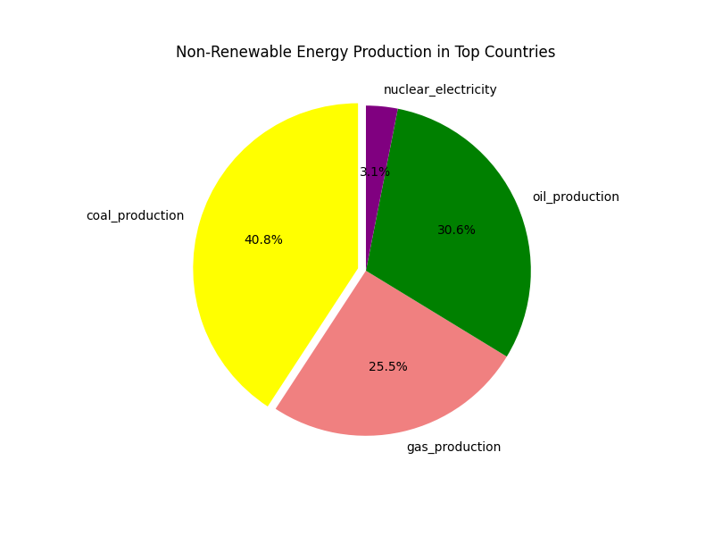

# Read the file we downloaded from Kaggle(https://www.kaggle.com/datasets/pralabhpoudel/world-energy-consumption/data)
# Data is reviewed and cleaned up
  -All columns are reviewed to see what we have
  -Info for the data fields is listed
  -Listed all fields with unavailable data
  -Filled all NAs with 0s to make calculations later
# Once data is reviewed, we created some additional columns: non_renewables_consumption, Total Energy Consumption, non_renewables_production, Total Energy Production,
non-renewables_prod_per_capita, total_prod_per_capita, non-renewables_cons_per_capita, total_cons_per_capita
# Displayed all data fields and their count
# We created countries_world_energy_df dataframe based on iso_code not equal to 0. Then we locked the data fields to >= 1980. So we can look at about 40 years of data
# We created top_countries data field based on:
  -Sorted countries_world_energy_df dataframe by Total Energy Production and Total Energy Consumption to find the top countries to include in the dataframe
  -The datafield we created included 89% of the World's Energy Production and Consumption
# We created top10_country_consumption and top10_country_production dataframes
# We created top_countries_renewable_consumption based on 11 countries that covered 75% of World's Renewable Energy Consumption and 71% of the World's Energy Production

# We creataed six continents to expand analysis based on total_production_per_capita and total_consumption_per_capita 
-We made a hv.plot.line to see Total Energy Consumption/Production Per Capita Over Time by Continent 

# We made a scatter plot to see correlation value between total_production_per_capita and total_consumption_per_capita. 

# We calculated the correalation value 
-The correlation value between total energy consumption per capita and total energy production per capita is 0.93, which indicates a strong positive correlation. 
# We did Statistical tests which is the T-test and Anova test 
As a result :
T-statistic: -10.633693692517605, p-value: 2.0983809186947106e-22
-The t-test results indicate a significant difference between total_prod_per_capita and total_cons_per_capita values. Given the negative t-statistic, we can conclude that total_prod_per_capita is significantly lower than total_cons_per_capita in the six_continents data. This finding could imply that, on a per capita basis, production levels are insufficient to meet consumption demands, which might indicate a reliance on energy imports or suggest other factors impacting energy availability and usage across these regions.

F_onewayResult(statistic=0.0066544684672841525, pvalue=0.999999999535522)
The ANOVA test results indicate that there is no significant difference in total_cons_per_capita across the years 2012 to 2022.
In practical terms, this suggests:
Stability over Time: The per capita energy consumption has remained relatively stable across this period, with little to no variation from year to year. 