# World Energy Consumption

## Contributors
- Amy Hanks
- Eylem Yildirim
- Sezer Bozoglan

## Project Overview
For this project, we selected the World Energy Consumption dataset to analyze global energy trends and their relationship with various economic and environmental factors.

### Analysis:
We explored the following questions:

- What is the relationship between energy production per capita and energy consumption per capita across different countries?
- Is there a correlation between renewable energy consumption and GDP?
- Is there a correlation between total energy consumption per capita and total energy production per capita across different continents?
- How do fluctuations in energy production and consumption correlate with major global events?
- What are the projected renewable energy consumption trends for the next 50 years based on current data?

## Data Collection
Data was collected from Kaggle: [link to data](https://www.kaggle.com/datasets/pralabhpoudel/world-energy-consumption/data)

## Data Cleanup
  - Filled missing data fields with 0s to ensure consistency
  - Created additional fields for a more comprehensive analysis:
  -   Non-renewables consumption
  -   Total energy consumption
  -   Non-renewables production
  -   Total energy production
  -   Non-renewables production per capita
  -   Total production per capita
  -   Non-renewables consumption per capita
  -   Total consumption per capita  
- The analysis period spanned 1985-2022
- Renewable energy projections were analyzed for the years 2010-2022
  
## Report
**Key Insights:**
- Our analysis focused on both renewable and non-renewable energy data, covering production and consumption across countries, continents, and their relationship with GDP.
- 37 countries in the dataset represented approximately 90% of global energy production and consumption, so our findings were primarily based on these countries.
- We created datasets for top_countries_renewable_cons and top_countries_renewable_prod, which represent 80% of the world’s renewable energy consumption and 77% of global renewable energy production, respectively.

**Pie graph showing renewable energy consumption categories for year 2022**
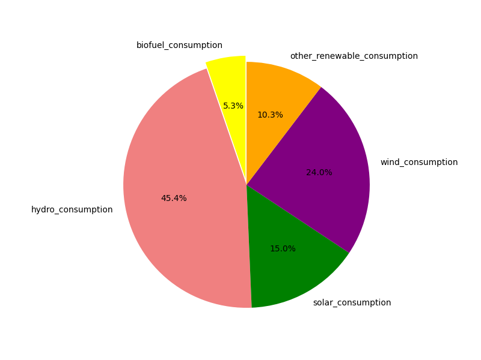

**Pie graph showing non-renewable energy consumption categories for year 2022**
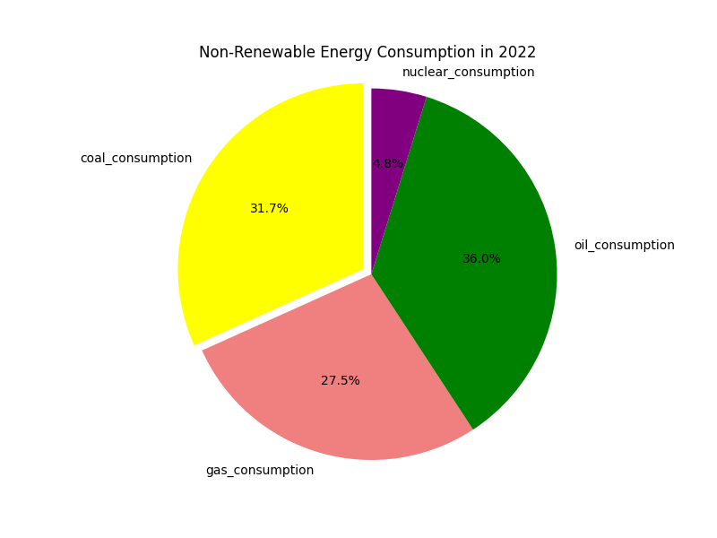

**Pie graph showing renewable and non-renewable energy consumption for year 2022**
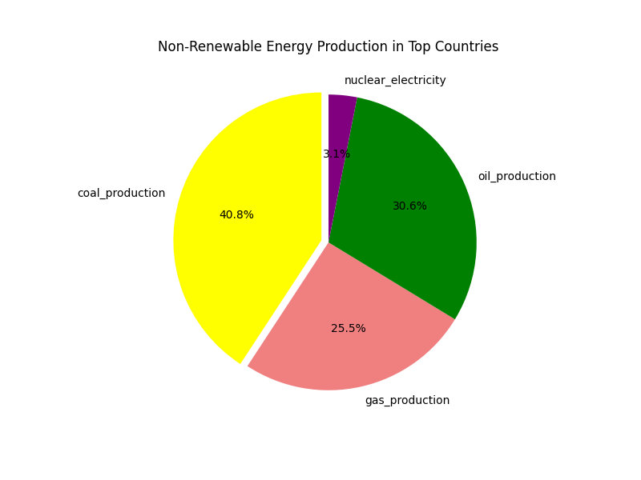

 #### What is the Relationship Between Energy Production Per Capita and Energy Consumption Per Capita Across Countries?

 To analyze the relationship between energy production and consumption per capita, we selected three representative years—spanning nearly a decade apart—to compare each country's data. The years chosen were 1995, 2005, and 2018.

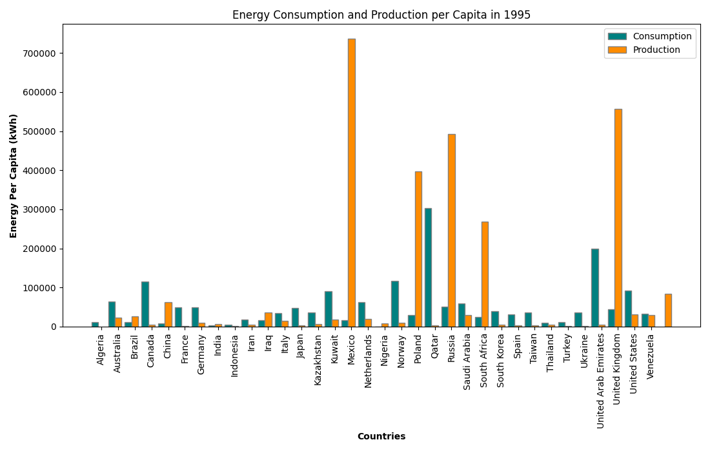

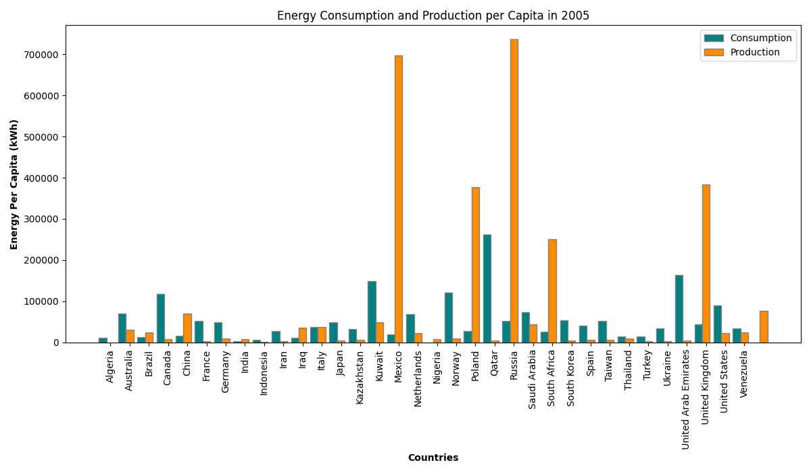

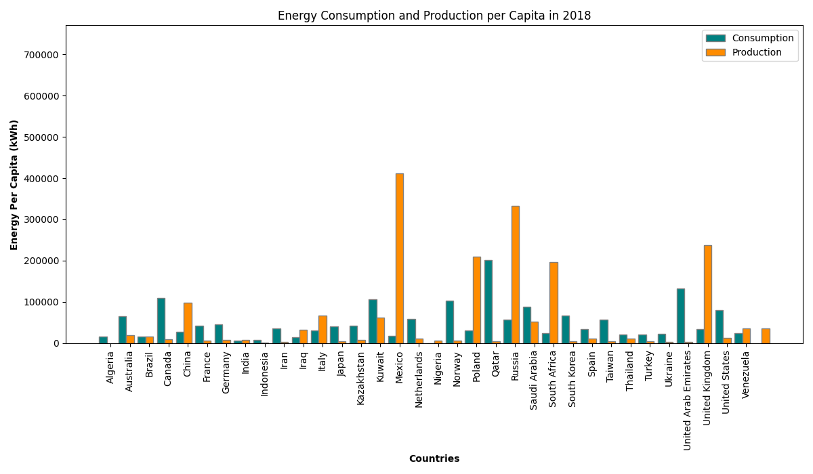

**Key Observations:**
- Balanced production and consumption: A few countries appear to produce and consume energy at roughly the same rate per capita.
- Energy deficit: Several countries produce less energy per capita than they consume.
- Energy surplus: Some countries produce more energy per capita than they consume.
- Trends over time: While there is some variation between countries, the overall patterns of energy production and consumption per capita remain relatively stable across the years. However, the 2018 graph indicates a decrease in both production and consumption per capita across the board, which could suggest technological improvements or increased global awareness around energy efficiency and sustainability.

 Let's look at the correlation between energy consumption per capita and energy production per capita:  

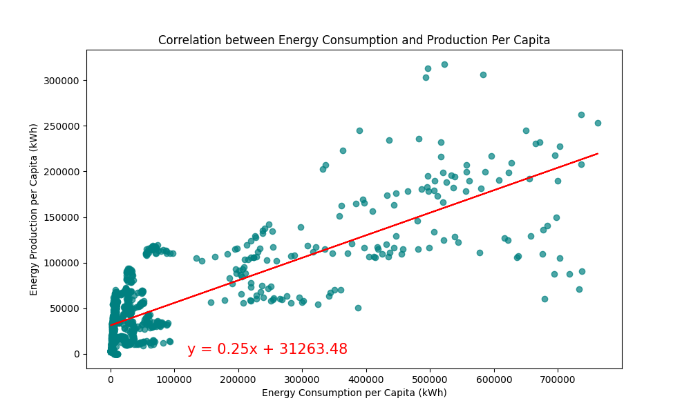

  - Correlation Coefficient: 0.79
  - r^2 :  0.62
  - T-statistic: 5.296761358343689
  - p-value: 1.3704128715598114e-07
  - ANOVA for Energy Consumption Per Capita from 2008-2018:
  - F_onewayResult(statistic = 0.014319448497051985, p value = 0.9999999844247471)
  - ANOVA for Energy Production Per Capita from 2008-2018:
  - F_onewayResult(statistic = 0.04569316056743195, p value = 0.9999954920296542)

 The correlation coefficient of 0.79 suggests that the energy consumption per capita and energy production per capita are strongly correlated. The r^2 value of 0.62 shows moderate to strong association between the consumption and production, but since 38% of the variability is still unexplained there is potential for further modeling. The positive T-statistic and the very small p-value suggests there is a statistically significant positive difference between energy production per capita and energy consumption per capita across the countries in our dataset. This suggests that energy production per capita exceeds energy consumption per capita across countries we looked at.   

 This could possibly mean certain regions rely on energy imports and others produce excess to fill that need, or perhaps different countries have better production efficiency or different energy needs.  

 The ANOVA results with f-statistics both very low and the p values extremely high indicate that energy consumption per capita and energy production per capita have been relatively stable across the years 2008-2018. 

#### Is There a Correlation Between Renewable Energy Consumption and GDP Across Countries

 To explore the relationship between renewable energy consumption and GDP, we calculated the average GDP and average renewable energy consumption for countries from 1985 to 2018 and plotted the data.

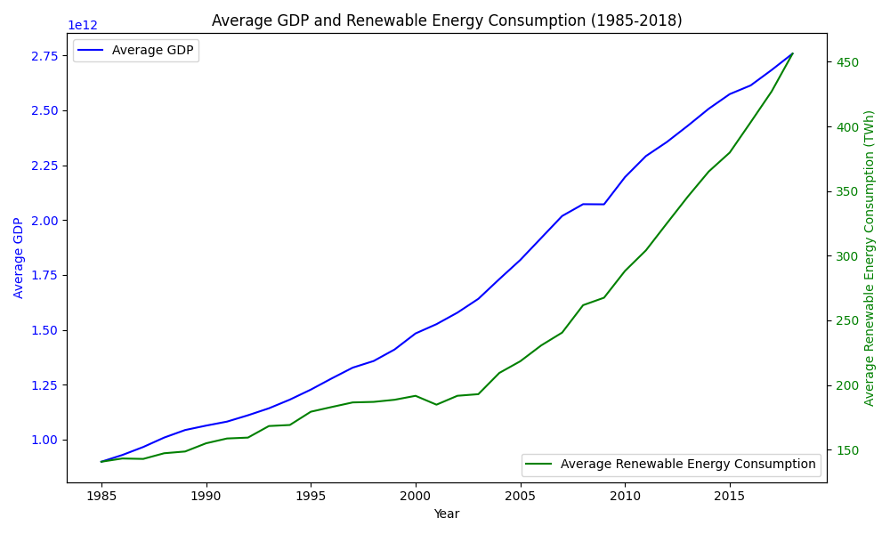

-The graph illustrates a similar trend between average GDP and average renewable energy consumption, with both variables showing similar shapes across the years.

 We then focused on the top six countries in terms of overall energy consumption and plotted GDP and renewable energy consumption from 1985 to 2018.

**Results for USA, China, Russia:**
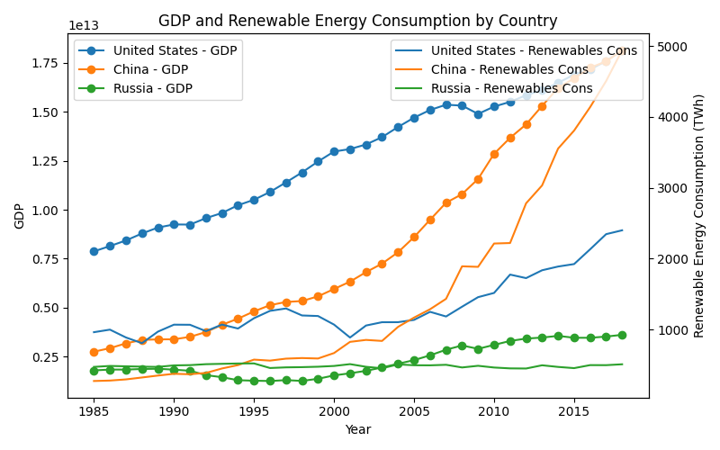

**Results for Japan, India, Germany:**
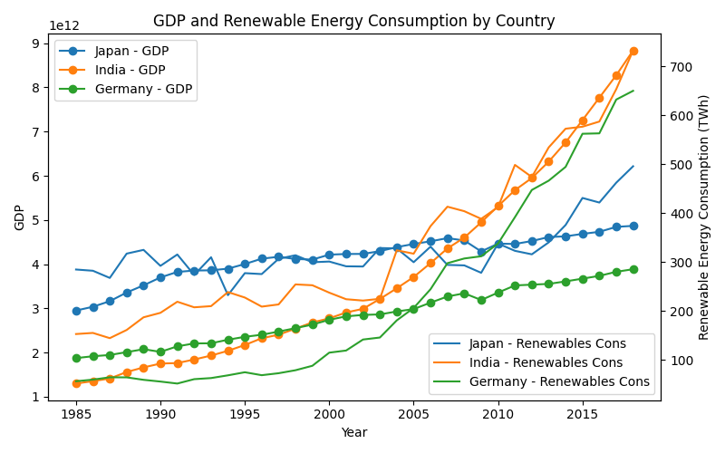

**Key Observations:**

- USA, China, and India show a strong correlation between GDP and renewable energy consumption, with both metrics following similar trends throughout the years.
- Russia presents a unique case: its GDP has shown minimal fluctuations, with slow but steady growth since the early 2000s. In contrast, renewable energy consumption in Russia has remained largely unchanged over time.
- Japan's renewable energy consumption generally follows its GDP trend, though with more variability, and shows a significant increase around 2012.
- Germany demonstrates steady GDP growth, which closely parallels its renewable energy consumption until around 2000, when it began to increase sharply.
- The United States has the largest gap between GDP and renewable energy consumption, possibly indicating slower adoption of renewable energy technologies.
- China has experienced the fastest growth in both GDP and renewable energy consumption, reflecting rapid economic expansion and adoption of renewable energy.
- Overall, the trend suggests that countries with higher GDP tend to consume more renewable energy, supporting our initial hypothesis that wealthier nations are more likely to have the resources, technology, and social pressure to adopt renewable energy.

 Let's see the correlation between GDP and renewable energy consumption: 

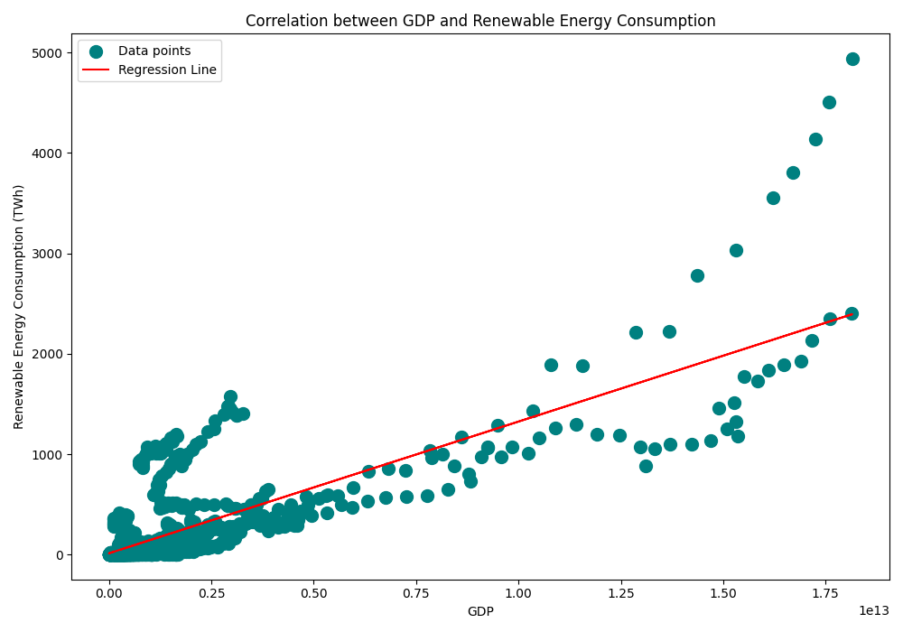

    Correlation Coefficient: 0.79
    T-statistic: 20.76401788304955
    p-value: 1.2461860989954291e-81
    ANOVA for Renewables Consumption:
    F_onewayResult(statistic = 0.31264537493261196, p value = 0.9777430943553933)
    ANOVA for GDP
    F_onewayResult(statistic = 0.14436975081836945, p value = 30.9990640510303093)

- The correlation coefficient of 0.79 suggests that GDP and renewable energy consumption have a strong positive correlation. This indicates increases in GDP correlates to increases in renewables consumption. The positive T-statistic and the very small p-value suggests there is a statistically significant positive difference between GDP and renewables energy consumption across the countries in our dataset. 

- The ANOVA results with f-statistics both very low and the p values extremely high indicate that GDP and renewables energy consumption have been relatively stable across the years 2008-2018. 

- This positive correlation between GDP and Renewables Energy Consumption supports our hypothesis that these variables are positively correlated. This strong positive correlation could imply that as countries become wealthier they may also be more conscious of climate change and sustainability. Perhaps wealthier countries are more likely to invest in renewable energy sources. They may have more technological advancements, government policies to require/incentivise use of renewable energy, or financial capacity to invest in such sources. 

#### How do energy production and consumption fluctuations correlate with major events?

We created a line graph to visualize the trends in renewable and non-renewable energy production and consumption over the years, incorporating major global events to examine potential correlations.

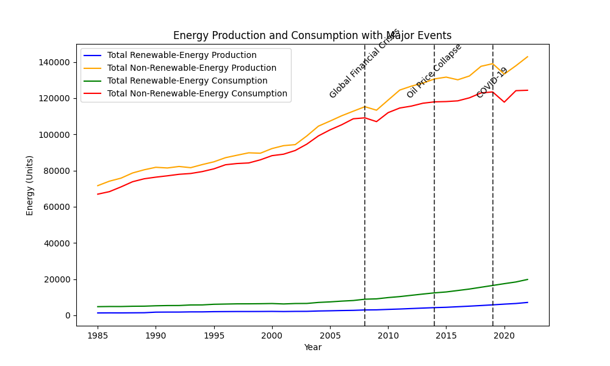

**Analysis Process**
- We first created an events dataframe and merged it with our main dataset to include the major events we wanted to analyze.
- To account for the potential delayed effects of major events on energy production and consumption, we created new columns for lagged years.
- We then performed regression analysis using the lagged variables to assess how major events might influence energy production and consumption patterns.

#### What are the projected renewable energy consumption trends for the next 50 years?
To project renewable energy consumption trends over the next 50 years, we built a linear regression model and used it to forecast future consumption levels.

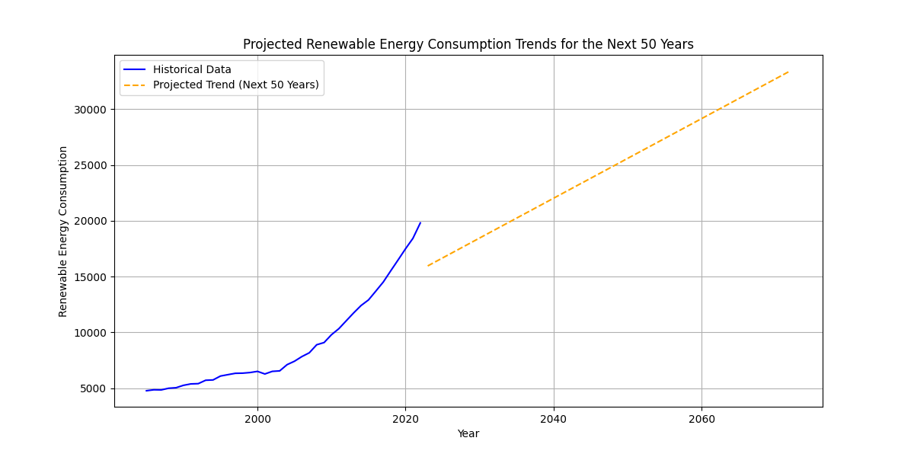

**Key Insights:**

- We calculated the projected percentage change in renewable energy consumption by 2072, estimating a 201.83% increase.
- Additionally, we forecasted values for non-renewable energy consumption and created a corresponding dataframe.
- After merging the data frames for both renewable and non-renewable projections, we visualized the projected energy consumption in 2072 with a pie chart.

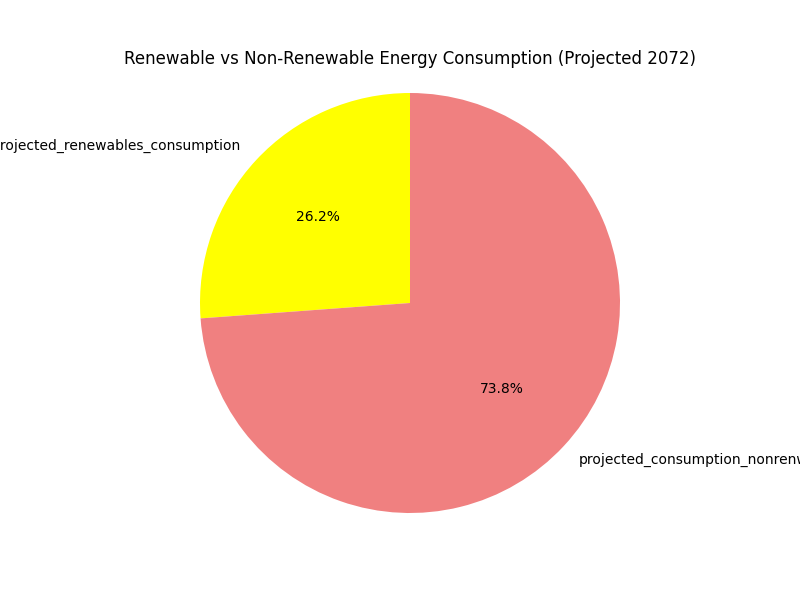

## Tech Stack
- Jupyter Lab
- matplotlib
- pandas
- hvplot
- numpy
- scipy.stats
- seaborn
- statsmodels.api
- holoviews

## Data Ethics and Considerations

The dataset used in this project is sourced from Kaggle. It is intended for informational purposes only and is not to be used for any commercial applications. All data will be handled ethically and responsibly in accordance with the source’s terms of use.

## References

- Ritchie, H., Rosado, P., Mathieu, E., & Roser, M (2023). Our World in Data: Energy dataset. Our World in Data. Retrieved from: [https://www.kaggle.com/datasets/pralabhpoudel/world-energy-consumption/data]
  
- Energy Institute - Statistical Review of World Energy (2024) [https://www.energyinst.org/statistical-review/]
 
- Ember - Yearly Electricity Data (2024) [https://ember-climate.org/data-catalogue/yearly-electricity-data/]; Energy Institute - Statistical Review of World Energy (2024) [https://www.energyinst.org/statistical-review/]
 
- Population based on various sources (2023) [https://ourworldindata.org/population-sources]
  
- U.S. Energy Information Administration - International Energy Data (2023) [https://www.eia.gov/opendata/bulkfiles.php]

- International Renewable Energy Agency (IRENA)-Renewable energy statistics (2023) [https://www.irena.org/Publications/2023/Jul/Renewable-energy-statistics-2023]

ChatGPT help on creating graphs with hvplot.pandas
- Creating event indicators for the major events, help from chatGPT
  def create_lagged_event_indicator(events_merge_df, lag_years=2):
    """
    Creates lagged event indicators for up to `lag_years` after the event.
    For example, if an event occurred in 2014, it will flag the years 2015, 2016, etc.
    """
    for lag in range(1, lag_years + 1):
        events_merge_df[f'event_indicator_lag_{lag}'] = events_merge_df['event_indicator'].shift(+lag, fill_value=0)
    return events_merge_df
- Regression analysis with lagged variables, help from chatGPT:
 
    X_prod = sm.add_constant(X_prod)
    X_cons = sm.add_constant(X_cons)

    model_prod = sm.OLS(y_prod, X_prod).fit()

    model_cons = sm.OLS(y_cons, X_cons).fit()

- ChatGPT help: 
  bar charts with all countries and both per capita variables
  left and right axes line plots 
  
