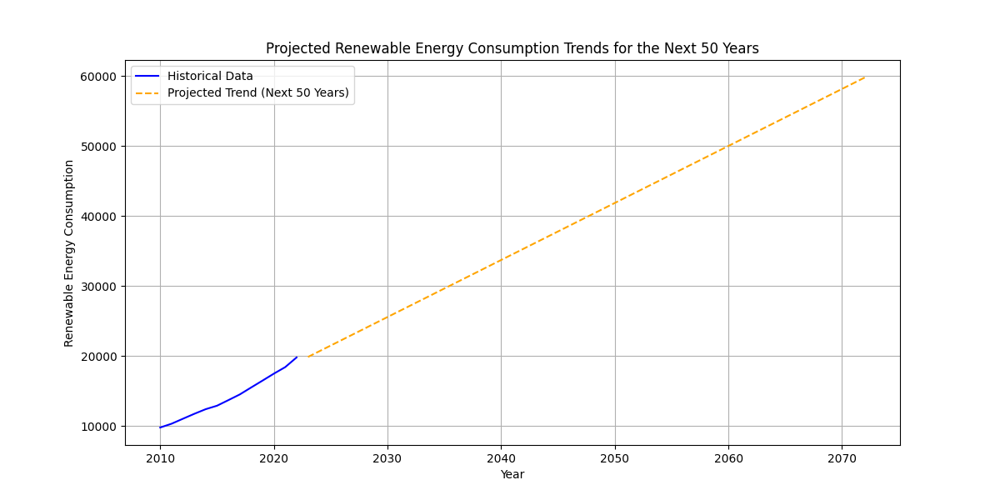

#Read the file we downloaded from Kaggle(https://www.kaggle.com/datasets/pralabhpoudel/world-energy-consumption/data)
#Data is reviewed and cleaned up
  - All columns are reviewed to see what we have
  - Info for the data fields is listed
  - Listed all fields with unavailable data
  - Filled all NAs with 0s to make calculations later
    
#Once data is reviewed, we created some additional columns: non_renewables_consumption, Total Energy Consumption, non_renewables_production, Total Energy Production,
non-renewables_prod_per_capita, total_prod_per_capita, non-renewables_cons_per_capita, total_cons_per_capita

#Displayed all data fields and their count

#We created countries_world_energy_df dataframe based on iso_code not equal to 0. Then we locked the data fields to >= 1985. So we can look at about 40 years of data

#We created top_countries data field based on:
  - Sorted countries_world_energy_df dataframe by Total Energy Production and Total Energy Consumption to find the top countries to include in the dataframe
  - The datafield we created included 89% of the World's Energy Production and Consumption
    
#We created top10_country_consumption and top10_country_production dataframes

#We created top_countries_renewable_cons and top_countries_renewable_prod that represented 80% of World's Renewable Energy Consumption and 77% of the World's Renewable Energy Production

#We created a dataframe filt_countries_world_energy for 2022 which is the last reported year with all production and consumption data

#Created a pie graph to show renewable energy consumption categories in 2022

#Created a pie graph to show non-renewable energy consumption categories in 2022

#Created a pie graph for renewable vs non-renewable energy consumption to see the current outlook

# AMY SECTION

#To show "energy production and consumption fluctuations correlate with major events", we followed below steps:
 - Created a line graph for renewable and non renewable energy production and consumption over the years with the major events to see the trends

 - Created events dataframe and merged with our main dataframe to include the events we want to analyze. We then created new columns for lagged years as effects of major events may have delayed or lingering impacts

 - Regression analysis with lagged variables

 - Regression results for "energy production and consumption fluctuations correlate with major events" supported the fact that there is a correlation between major events and energy production/consumption values

#To show "projected renewable energy consumption trends for the next 50 years", we followed below steps:
 - Built a linear regression model and projected future renewable energy consumption levels

 - Calculated projected percentage change in renewable energy consumption in 2072: 201.83%
   
#Found projected values for non-renewables energy consumption and created dataframe

#Merged data frames for both projected values and plotted a pie chart to show projected energy consumption values for 2072

#We creataed six continents to expand analysis based on total_production_per_capita and total_consumption_per_capita 
 - We made a hv.plot.line to see Total Energy Consumption/Production Per Capita Over Time by Continent 

#We made a scatter plot to see correlation value between total_production_per_capita and total_consumption_per_capita. 

#We calculated the correalation value 
- The correlation value between total energy consumption per capita and total energy production per capita is 0.93, which indicates a strong positive correlation. 
#We did Statistical tests which is the T-test and Anova test 
As a result :
#T-statistic: -10.633693692517605, p-value: 2.0983809186947106e-22
- The t-test results indicate a significant difference between total_prod_per_capita and total_cons_per_capita values. Given the negative t-statistic, we can conclude that total_prod_per_capita is significantly lower than total_cons_per_capita in the six_continents data. This finding could imply that, on a per capita basis, production levels are insufficient to meet consumption demands, which might indicate a reliance on energy imports or suggest other factors impacting energy availability and usage across these regions.

F_onewayResult(statistic=0.0066544684672841525, pvalue=0.999999999535522)
The ANOVA test results indicate that there is no significant difference in total_cons_per_capita across the years 2012 to 2022.
In practical terms, this suggests:
Stability over Time: The per capita energy consumption has remained relatively stable across this period, with little to no variation from year to year. 

# REFERENCES 
- ChatGPT help on creating graphs with hvplot.pandas
- Creating event indicators for the major events, help from chatGPT
  def create_lagged_event_indicator(events_merge_df, lag_years=2):
    """
    Creates lagged event indicators for up to `lag_years` after the event.
    For example, if an event occurred in 2014, it will flag the years 2015, 2016, etc.
    """
    for lag in range(1, lag_years + 1):
        events_merge_df[f'event_indicator_lag_{lag}'] = events_merge_df['event_indicator'].shift(+lag, fill_value=0)
    return events_merge_df
- Regression analysis with lagged variables, help from chatGPT:
 
    X_prod = sm.add_constant(X_prod)
    X_cons = sm.add_constant(X_cons)

    model_prod = sm.OLS(y_prod, X_prod).fit()

    model_cons = sm.OLS(y_cons, X_cons).fit()
